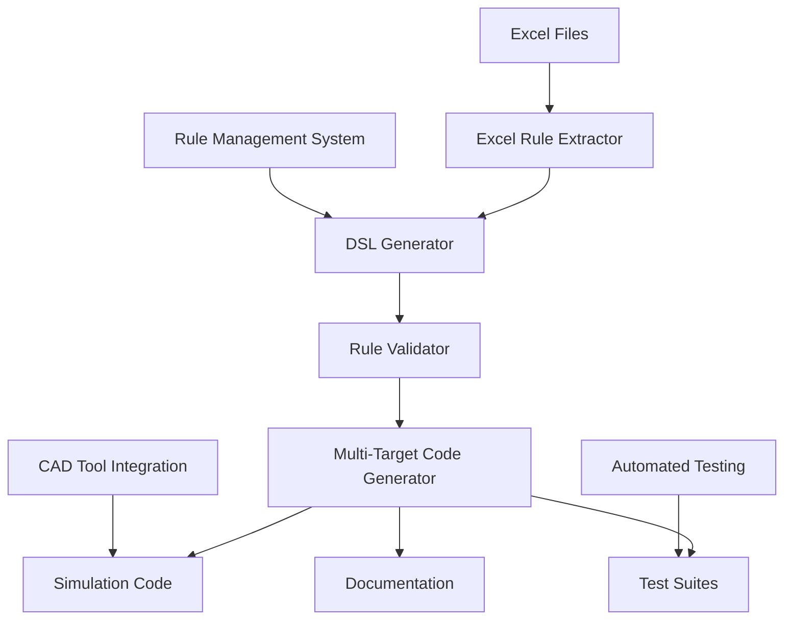

# SOA Rule Automation: Unified DSL Solution Proposal

## Executive Summary

**Problem**: Current SOA rule implementation requires 138 engineering days per rule set with high error rates and manual processes.

**Solution**: Unified Domain Specific Language (DSL) with automated toolchain for SOA rule processing.

**Impact**: 98% time reduction, $485K annual savings, 4.7-month payback period.

---

## 📊 Current State Analysis

### The Problem We Face

Our organization processes SOA (Safe Operating Area) rules through a completely manual workflow that is:

- **Time-Intensive**: 1,228 hours (138 days) per rule set
- **Error-Prone**: 15-30% error rates across workflow steps  
- **Inconsistent**: Implementation varies by engineer
- **Non-Scalable**: Limited to 1 rule set per quarter
- **Maintenance-Heavy**: Full re-implementation required for changes

### Rule Complexity Analysis

From our analysis of 277 SOA rules across 13 device types:

| Rule Type | Count | Examples |
|-----------|-------|----------|
| **Simple Numeric** | 390 | `vhigh: 1.65V` |
| **Temperature Dependent** | 15 | `0.9943V - (0.0006*(T-25))` |
| **Multi-Pin Voltage** | 9 | `min(90, 90+V[p]-v[sub])` |
| **Current with Parameters** | - | `$w*$np*2.12e-4` |
| **tmaxfrac Constraints** | 274 | Time-based transient limits |
| **Complex Equations** | 273 | Mathematical expressions |

### Current Workflow Costs

| Step | Time (Hours) | Error Rate | Cost Impact |
|------|-------------|------------|-------------|
| Rule Extraction | 138.5 | 15% | Manual Excel parsing |
| Implementation | 554.0 | 20% | Hand-coding each rule |
| Testing | 277.0 | 25% | Individual test creation |
| Debugging | 138.5 | 30% | Manual error resolution |
| Integration | 40.0 | 10% | CAD tool configuration |
| Documentation | 80.0 | 20% | Manual documentation |
| **TOTAL** | **1,228 hours** | **20% avg** | **$122,800 per rule set** |

---

## 🎯 Proposed Solution: SOA DSL

### Unified Domain Specific Language

A comprehensive DSL that handles all SOA rule types with unified syntax:

```dsl
rule nmos_core_vds_tmaxfrac {
    name: "NMOS Core VDS with tmaxfrac"
    device: mos_transistor.core.nmos
    parameter: v[d,s]
    type: voltage
    severity: high
    
    constraints {
        vhigh_steady: 1.65,
        vhigh_equation: "1.2 + (T-25)*0.001"
    }
    
    tmaxfrac {
        0.1: 1.71,    // 10% of time
        0.01: 1.84,   // 1% of time
        0.0: 1.65     // Steady state
    }
}
```

### Key DSL Features

- **Unified Syntax**: Single format for all rule types
- **Multi-Pin Support**: `v[d,s]`, `v[g,b]`, etc.
- **Mathematical Expressions**: Full equation support
- **Function Support**: `min()`, `max()`, `abs()`, etc.
- **Temperature Dependencies**: `T`, `temp` variables
- **Device Parameters**: `$width`, `$length`, etc.
- **tmaxfrac Constraints**: Time-based transient limits
- **Conditional Logic**: `if-then-else` constructs

---

## 🏗️ Implementation Architecture

### Toolchain Components



### 8 Core Components

1. **Excel Rule Extractor**: Automated parsing of arbitrary Excel formats
2. **DSL Parser**: Convert DSL to Abstract Syntax Tree (AST)
3. **Rule Validator**: Syntax, semantics, and physics validation
4. **Multi-Target Code Generator**: Generate code for multiple platforms
5. **Simulation Runtime Engine**: Real-time rule compliance monitoring
6. **Test Case Generator**: Automated comprehensive test creation
7. **Rule Management System**: Version control and lifecycle management
8. **CAD Tool Integration**: Seamless integration with existing tools

### System Architecture Layers

| Layer | Components | Technologies |
|-------|------------|-------------|
| **Presentation** | Web Dashboard, CLI Tools, CAD Plugins | React/Vue.js, Python CLI |
| **Application** | Workflow Engine, Rule Manager, Validator | Python/Java, Business Rules |
| **Processing** | Parsers, Transformers, Code Generators | ANTLR4, AST libraries |
| **Data** | Rule Database, Version Control, Cache | PostgreSQL, Git, Redis |

---

## 📈 Automation Workflow

### Current vs. Automated Process

| Step | Current Method | Automated Method | Time Savings |
|------|---------------|------------------|--------------|
| **Rule Extraction** | Manual Excel parsing (138.5h) | Automated parser (2h) | **99.1%** |
| **Implementation** | Hand-coding (554h) | Code generation (8h) | **98.6%** |
| **Testing** | Manual test creation (277h) | Auto-generated tests (4h) | **98.6%** |
| **Debugging** | Manual debugging (138.5h) | Automated validation (8h) | **94.2%** |
| **Integration** | Manual configuration (40h) | Automated deployment (2h) | **95.0%** |
| **Documentation** | Manual docs (80h) | Auto-generated (1h) | **98.8%** |

### Automated Workflow Steps

1. **Excel Upload** → Automated rule extraction with pattern recognition
2. **DSL Generation** → Automatic conversion to unified DSL format
3. **Validation** → Comprehensive syntax and physics checking
4. **Code Generation** → Multi-platform simulation code creation
5. **Test Generation** → Comprehensive test suite creation
6. **Deployment** → Automated integration with CAD tools
7. **Monitoring** → Real-time compliance tracking

---

## 💰 Business Case & ROI

### Cost Analysis

| Metric | Current | Automated | Improvement |
|--------|---------|-----------|-------------|
| **Time per Rule Set** | 1,228 hours | 25 hours | **98.0% reduction** |
| **Cost per Rule Set** | $122,800 | $1,500 | **98.8% reduction** |
| **Error Rate** | 20% average | 2% average | **90% reduction** |
| **Processing Capacity** | 1 set/quarter | Multiple sets/week | **10x+ increase** |

### ROI Analysis

- **Development Investment**: $192,000 (48 weeks × $4,000/week)
- **Annual Savings**: $485,200 (4 rule sets × $121,300 savings)
- **Payback Period**: **4.7 months**
- **3-Year ROI**: **656%**
- **Break-even**: After **1.6 rule sets**

### 5-Year Financial Impact

| Year | Investment | Savings | Cumulative ROI |
|------|------------|---------|----------------|
| Year 0 | $192,000 | $0 | -$192,000 |
| Year 1 | $0 | $485,200 | $293,200 |
| Year 2 | $0 | $485,200 | $778,400 |
| Year 3 | $0 | $485,200 | $1,263,600 |
| Year 4 | $0 | $485,200 | $1,748,800 |
| Year 5 | $0 | $485,200 | $2,234,000 |

---

## 🎯 Key Benefits

### Quantitative Benefits

- **98% Time Reduction**: From 138 days to 3 days per rule set
- **$485K Annual Savings**: Reduced engineering overhead
- **90% Error Reduction**: From 20% to 2% average error rate
- **10x Scalability**: Process multiple rule sets per week
- **4.7 Month Payback**: Rapid return on investment

### Qualitative Benefits

- **Standardization**: Consistent implementation across all rules
- **Quality**: Automated validation and comprehensive testing
- **Maintainability**: Easy updates and version control
- **Traceability**: Complete audit trail from Excel to implementation
- **Knowledge Preservation**: Reduced dependency on expert knowledge
- **Future-Proofing**: Extensible architecture for new rule types

### Strategic Advantages

- **Competitive Edge**: Faster time-to-market for new technologies
- **Resource Optimization**: Free up expert engineers for innovation
- **Risk Reduction**: Lower error rates and better compliance
- **Scalability**: Handle increasing rule complexity and volume
- **Automation Leadership**: Establish best practices for rule processing

---

## 📅 Implementation Plan

### Phase 1: Core DSL Foundation (16 weeks)
**Deliverables**: Working DSL parser, basic validation, simple code generation

- Week 1-6: DSL specification and parser development
- Week 7-12: Rule validator and basic code generator
- Week 13-16: Integration testing and documentation

**Investment**: $64,000 | **Risk**: Medium

### Phase 2: Automation & Enhancement (14 weeks)
**Deliverables**: Excel automation, test generation, multi-platform support

- Week 1-6: Excel rule extractor with ML pattern recognition
- Week 7-10: Automated test case generator
- Week 11-14: Enhanced code generator for multiple platforms

**Investment**: $56,000 | **Risk**: Low

### Phase 3: Integration & Production (18 weeks)
**Deliverables**: CAD integration, runtime monitoring, production deployment

- Week 1-8: Simulation runtime engine and monitoring
- Week 9-14: Rule management system and version control
- Week 15-18: CAD tool integration and production deployment

**Investment**: $72,000 | **Risk**: Medium

### Total Timeline: 48 weeks (12 months)
### Total Investment: $192,000

---

## 🔄 Migration Strategy

### Parallel Development Approach

1. **Pilot Project** (Weeks 1-16)
   - Select 1 device type for initial implementation
   - Validate DSL approach with real rules
   - Gather feedback and refine specification

2. **Gradual Rollout** (Weeks 17-32)
   - Expand to 3-4 device types
   - Train team on new workflow
   - Maintain parallel manual process for backup

3. **Full Production** (Weeks 33-48)
   - Complete automation for all device types
   - Phase out manual processes
   - Establish new operational procedures

### Risk Mitigation

- **Technical Risk**: Prototype validation in Phase 1
- **Adoption Risk**: Gradual rollout with training
- **Integration Risk**: Early CAD tool engagement
- **Quality Risk**: Comprehensive testing and validation

---

## 🚀 Success Metrics

### Technical Metrics

- **Processing Time**: Target 98% reduction (1,228h → 25h)
- **Error Rate**: Target 90% reduction (20% → 2%)
- **Test Coverage**: Target 95%+ automated coverage
- **Integration Success**: 100% CAD tool compatibility

### Business Metrics

- **ROI Achievement**: Target 4.7-month payback
- **Cost Savings**: Target $485K annual savings
- **Productivity**: Target 10x processing capacity increase
- **Quality**: Target 90% reduction in post-deployment issues

### Operational Metrics

- **User Adoption**: Target 100% team adoption within 6 months
- **Training Efficiency**: Target 80% reduction in onboarding time
- **Maintenance Overhead**: Target 75% reduction in rule maintenance
- **Documentation Quality**: Target 100% automated documentation

---

## 🎯 Recommendation

### Immediate Actions Required

1. **Approve Project**: Authorize $192K investment for 12-month development
2. **Assemble Team**: Dedicate 2-3 engineers for development
3. **Stakeholder Engagement**: Involve CAD tool vendors early
4. **Pilot Selection**: Choose initial device type for validation

### Expected Outcomes

- **Short-term** (6 months): Working DSL system for pilot device type
- **Medium-term** (12 months): Full automation for all rule types
- **Long-term** (24 months): Industry-leading SOA rule processing capability

### Strategic Impact

This investment positions our organization as a leader in semiconductor design automation, providing:

- **Competitive Advantage**: Faster, more reliable rule processing
- **Innovation Enablement**: Free up experts for advanced R&D
- **Operational Excellence**: Standardized, scalable processes
- **Future Readiness**: Extensible platform for emerging technologies

---

## 📞 Next Steps

1. **Executive Review**: Present proposal to leadership team
2. **Technical Deep Dive**: Detailed architecture review with engineering
3. **Vendor Discussions**: Engage CAD tool partners for integration planning
4. **Budget Approval**: Secure funding for Phase 1 development
5. **Team Formation**: Assemble development and pilot teams
6. **Project Kickoff**: Begin Phase 1 development

---

**Contact**: [Your Name] | [Email] | [Phone]  
**Date**: [Current Date]  
**Version**: 1.0

---

*This proposal represents a transformational opportunity to modernize our SOA rule processing workflow, delivering significant time savings, cost reductions, and quality improvements while positioning our organization for future growth and innovation.*